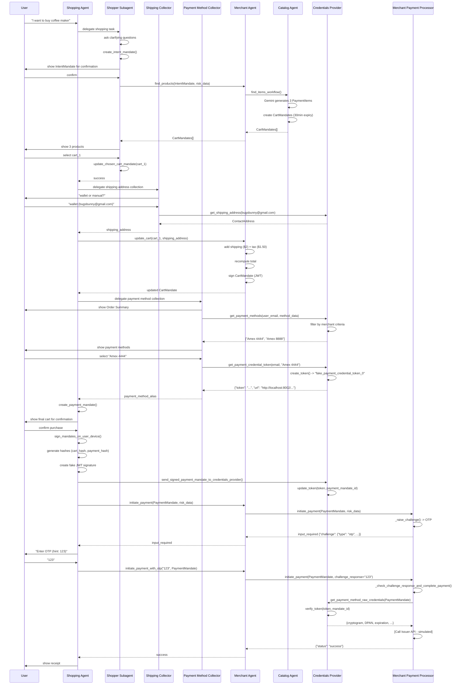

# 📋 Детальное описание сценария Human-Present (Cards)

## 🎬 Точка входа

### `samples/python/scenarios/a2a/human-present/cards/run.sh`
**Назначение**: Автоматизация запуска всего сценария

**Что делает**:
1. Проверяет наличие `GOOGLE_API_KEY` (или `GOOGLE_GENAI_USE_VERTEXAI=true`)
2. Создает/активирует virtual environment через `uv`
3. Устанавливает пакет `ap2-samples` в editable mode
4. Синхронизирует зависимости через `uv sync`
5. Очищает логи в `.logs/`
6. **Запускает 4 сервера в фоне**:
   - Merchant Agent (port 8001)
   - Credentials Provider Agent (port 8002)
   - Merchant Payment Processor Agent (port 8003)
   - Shopping Agent (web UI на 0.0.0.0:8000 через ADK)
7. При завершении (EXIT trap) убивает все процессы
8. Логи пишутся в `.logs/merchant_agent.log`, `.logs/credentials_provider_agent.log`, `.logs/mpp_agent.log`

---

## 🛍️ Shopping Agent (главный оркестратор)

### `roles/shopping_agent/agent.py`
**Тип**: RetryingLlmAgent на базе Gemini 2.5 Flash
**Роль**: Корневой агент, управляющий всем процессом покупки

**Архитектура**:
- **3 подагента** (sub_agents):
  - `shopper` — поиск товаров, создание IntentMandate, выбор из CartMandates
  - `shipping_address_collector` — сбор адреса доставки (через wallet или вручную)
  - `payment_method_collector` — выбор платежного метода

- **6 tools**:
  - `create_payment_mandate` — создание PaymentMandate
  - `initiate_payment` — инициация платежа
  - `initiate_payment_with_otp` — повтор платежа с OTP
  - `send_signed_payment_mandate_to_credentials_provider` — отправка подписанного mandate
  - `sign_mandates_on_user_device` — симуляция подписания на устройстве
  - `update_cart` — обновление корзины с адресом доставки

**Инструкции** (3 сценария):
1. **Scenario 1**: Покупка товара
   - Делегирует `shopper` → получает CartMandate
   - Делегирует `shipping_address_collector` → получает адрес
   - Вызывает `update_cart` → обновленный CartMandate с shipping/tax
   - Делегирует `payment_method_collector` → получает payment_method_alias
   - Показывает экран "trusted surface" (симуляция)
   - Вызывает `create_payment_mandate`
   - Показывает финальную корзину (price, shipping, tax, total, refund period)
   - Подтверждение пользователя
   - Вызывает `sign_mandates_on_user_device` + `send_signed_payment_mandate_to_credentials_provider`
   - Вызывает `initiate_payment`
   - Если OTP challenge → запрашивает у пользователя → `initiate_payment_with_otp`
   - Показывает receipt

2. **Scenario 2**: Verbose mode (описывает все данные)

3. **Scenario 3**: Другие запросы → показывает help message

### `roles/shopping_agent/tools.py`
**8 функций** для Shopping Agent:

1. **`update_cart(shipping_address, tool_context)`**
   - Отправляет A2A message в Merchant Agent
   - Добавляет в DataParts: `cart_id`, `shipping_address`, `shopping_agent_id`
   - Получает обновленный CartMandate (с shipping/tax)
   - Сохраняет в `tool_context.state`

2. **`initiate_payment(tool_context)`**
   - Достает `signed_payment_mandate` и `risk_data` из state
   - Отправляет A2A message в Merchant Agent
   - Сохраняет `initiate_payment_task_id` для продолжения (OTP)

3. **`initiate_payment_with_otp(challenge_response, tool_context)`**
   - Повторяет `initiate_payment` с `challenge_response`
   - Использует сохраненный `task_id` для продолжения задачи

4. **`create_payment_mandate(payment_method_alias, user_email, tool_context)`**
   - Формирует `PaymentResponse` с token, shipping_address, email
   - Создает `PaymentMandate` с:
     - `payment_mandate_id` (uuid)
     - `timestamp` (ISO 8601)
     - `payment_details_id`, `payment_details_total` из CartMandate
     - `payment_response`, `merchant_agent`

5. **`sign_mandates_on_user_device(tool_context)`**
   - **PLACEHOLDER**: Симуляция hardware-backed signing
   - Генерирует хеши CartMandate и PaymentMandateContents
   - Создает fake JWT: `cart_mandate_hash + "_" + payment_mandate_hash`
   - Записывает в `payment_mandate.user_authorization`
   - Сохраняет как `signed_payment_mandate` в state

6. **`send_signed_payment_mandate_to_credentials_provider(tool_context)`**
   - Отправляет подписанный PaymentMandate в CP
   - Включает `risk_data`

7. **`_generate_cart_mandate_hash(cart_mandate)`** — placeholder для SHA-256

8. **`_generate_payment_mandate_hash(payment_mandate_contents)`** — placeholder для SHA-256

### `roles/shopping_agent/remote_agents.py`
**Клиенты для удаленных агентов**:
```python
credentials_provider_client = PaymentRemoteA2aClient(
    base_url="http://localhost:8002/a2a/credentials_provider",
    required_extensions={EXTENSION_URI}
)

merchant_agent_client = PaymentRemoteA2aClient(
    base_url="http://localhost:8001/a2a/merchant_agent",
    required_extensions={EXTENSION_URI}
)
```
- Формирует **allowlist** доверенных агентов
- Автоматически добавляет `X-A2A-Extensions` header

---

## 🔍 Shopper Subagent

### `roles/shopping_agent/subagents/shopper/agent.py`
**Роль**: Помощь пользователю в покупке, создание IntentMandate

**Workflow**:
1. Собирает информацию о желаниях пользователя (задает уточняющие вопросы)
2. Вызывает `create_intent_mandate` с собранной информацией
3. Показывает IntentMandate пользователю для подтверждения
4. После подтверждения вызывает `find_products` → список CartMandates
5. Показывает товары пользователю в numbered list
6. Пользователь выбирает → вызывает `update_chosen_cart_mandate`
7. Передает управление root_agent

### `roles/shopping_agent/subagents/shopper/tools.py`

1. **`create_intent_mandate(...)`**
   - Параметры: `natural_language_description`, `user_cart_confirmation_required`, `merchants`, `skus`, `requires_refundability`
   - Создает `IntentMandate` с TTL = 1 день
   - Сохраняет в state

2. **`find_products(tool_context)`**
   - Формирует A2A message с `IntentMandate` и `risk_data`
   - Отправляет в Merchant Agent
   - Получает список `CartMandate` objects
   - Сохраняет `shopping_context_id` и `cart_mandates` в state

3. **`update_chosen_cart_mandate(cart_id, tool_context)`**
   - Ищет CartMandate по `cart_id` в списке
   - Сохраняет `chosen_cart_id` в state

4. **`_collect_risk_data(tool_context)`** — создает fake risk_data JWT

---

## 📍 Shipping Address Collector Subagent

### `roles/shopping_agent/subagents/shipping_address_collector/agent.py`
**Роль**: Сбор адреса доставки

**Два пути**:

**Scenario 1**: Digital Wallet
- Спрашивает какой wallet использовать
- Показывает message о redirect для OAuth (симуляция)
- Использует hardcoded email `bugsbunny@gmail.com`
- Вызывает `get_shipping_address` tool

**Scenario 2**: Manual entry
- Собирает полный US адрес вручную

### `roles/shopping_agent/subagents/shipping_address_collector/tools.py`

1. **`get_shipping_address(user_email, tool_context)`**
   - Отправляет A2A message в Credentials Provider
   - Получает `ContactAddress` из CP
   - Сохраняет в state, возвращает root_agent

---

## 💳 Payment Method Collector Subagent

### `roles/shopping_agent/subagents/payment_method_collector/agent.py`
**Роль**: Выбор платежного метода

**Workflow**:
1. Показывает Order Summary (merchant, item, price, shipping, tax, total, expires, refund period)
2. Показывает shipping address
3. Вызывает `get_payment_methods` → список aliases
4. Показывает numbered list payment methods
5. Пользователь выбирает
6. Вызывает `get_payment_credential_token`
7. Возвращает root_agent с `payment_method_alias`

### `roles/shopping_agent/subagents/payment_method_collector/tools.py`

1. **`get_payment_methods(user_email, tool_context)`**
   - Извлекает `method_data` из CartMandate
   - Отправляет в CP с `user_email` и `PaymentMethodData[]`
   - Получает список `payment_method_aliases`

2. **`get_payment_credential_token(user_email, payment_method_alias, tool_context)`**
   - Запрашивает token у CP
   - Получает token и agent_card.url
   - Сохраняет в state как:
     ```python
     {
       "value": token,
       "url": credentials_provider_agent_card.url
     }
     ```

---

## 🏪 Merchant Agent

### `roles/merchant_agent/agent_executor.py`
**Тип**: BaseServerExecutor (A2A framework)
**Роль**: Обработка запросов Shopping Agent

**Особенности**:
- **Allowlist**: Проверяет `shopping_agent_id` в `_KNOWN_SHOPPING_AGENTS`
- Если не в списке → fails task с "Unauthorized Request"

**4 tools**:
- `update_cart` — обновление корзины с shipping
- `find_items_workflow` (catalog_agent) — поиск товаров
- `initiate_payment` — инициация платежа через MPP
- `dpc_finish` — финализация DPC response (для Android сценария)

### `roles/merchant_agent/tools.py`

1. **`update_cart(data_parts, updater, current_task)`**
   - Извлекает `cart_id` и `shipping_address`
   - Достает CartMandate из storage
   - Добавляет shipping_address в `payment_request.shipping_address`
   - Добавляет shipping ($2) и tax ($1.50) в `display_items`
   - Пересчитывает `total.amount.value` (сумма всех items)
   - Подписывает CartMandate (fake JWT `_FAKE_JWT`)
   - Возвращает обновленный CartMandate + risk_data

2. **`initiate_payment(data_parts, updater, current_task)`**
   - Извлекает PaymentMandate и risk_data
   - Определяет payment processor URL по `payment_response.method_name`
   - Маппинг: `{"CARD": "http://localhost:8003/..."}`
   - Создает `PaymentRemoteA2aClient` для MPP
   - Отправляет A2A message с PaymentMandate, risk_data, challenge_response (если есть)
   - Если есть `current_task` → использует `payment_processor_task_id` для продолжения
   - Обновляет task status по ответу MPP

3. **`dpc_finish(data_parts, updater, current_task)`**
   - Для Android DPC сценария
   - Получает `dpc_response` (OpenID4VP JSON)
   - TODO: Validate nonce, merchant attributes, pass to MPP
   - Симулирует успешный платеж

4. **`_get_payment_processor_task_id(task)`** — извлекает task_id MPP из истории

### `roles/merchant_agent/sub_agents/catalog_agent.py`
**Роль**: Генерация товаров на основе IntentMandate

**`find_items_workflow(data_parts, updater, current_task)`**:
1. Извлекает `IntentMandate` из data_parts
2. Формирует prompt для Gemini:
   ```
   Based on the user's request for '{intent}', generate 3 complete,
   unique and realistic PaymentItem JSON objects.
   EXCLUDE all branding from label field.
   ```
3. Использует `response_schema: list[PaymentItem]` для structured output
4. Для каждого PaymentItem создает CartMandate:
   - `payment_request.method_data`: `[{supported_methods: "CARD", data: {network: ["mastercard", "paypal", "amex"]}}]`
   - `cart_expiry`: 30 минут
   - `merchant_name`: "Generic Merchant"
5. Сохраняет CartMandates в storage (key = `cart_id`)
6. Возвращает массив CartMandates + risk_data

### `roles/merchant_agent/storage.py`
**In-memory storage** для:
- `CartMandate` (key = cart_id)
- `risk_data` (key = context_id)

Простой dict: `_store = {}`

---

## 💼 Credentials Provider Agent

### `roles/credentials_provider_agent/agent_executor.py`
**Тип**: BaseServerExecutor
**Роль**: Secure digital wallet

**5 tools**:
- `handle_create_payment_credential_token` — создание token
- `handle_get_payment_method_raw_credentials` — обмен token на credentials
- `handle_get_shipping_address` — получение адреса
- `handle_search_payment_methods` — поиск подходящих payment methods
- `handle_signed_payment_mandate` — обработка подписанного mandate

### `roles/credentials_provider_agent/tools.py`

1. **`handle_get_shipping_address(data_parts, updater, current_task)`**
   - Извлекает `user_email`
   - Вызывает `account_manager.get_account_shipping_address(user_email)`
   - Возвращает `ContactAddress`

2. **`handle_search_payment_methods(data_parts, updater, current_task)`**
   - Извлекает `user_email` и `PaymentMethodData[]` (критерии merchant'а)
   - Получает все payment methods пользователя
   - Фильтрует по `_payment_method_is_eligible`:
     - Проверяет `payment_method.type == merchant_criteria.supported_methods`
     - Проверяет `payment_method.network` в `merchant_criteria.data.network`
   - Возвращает `{"payment_method_aliases": [...]}`

3. **`handle_get_payment_method_raw_credentials(data_parts, updater, current_task)`**
   - Извлекает PaymentMandate
   - Достает token из `payment_response.details.token.value`
   - Вызывает `account_manager.verify_token(token, payment_mandate_id)`
   - Проверяет что token связан с правильным payment_mandate_id
   - Возвращает raw payment method (cryptogram, DPAN, expiration, billing address)

4. **`handle_create_payment_credential_token(data_parts, updater, current_task)`**
   - Извлекает `user_email` и `payment_method_alias`
   - Вызывает `account_manager.create_token(user_email, payment_method_alias)`
   - Возвращает `{"token": tokenized_payment_method}`

5. **`handle_signed_payment_mandate(data_parts, updater, current_task)`**
   - Извлекает PaymentMandate
   - Достает token и payment_mandate_id
   - Вызывает `account_manager.update_token(token, payment_mandate_id)`
   - Связывает token с конкретным mandate (защита от replay attacks)

### `roles/credentials_provider_agent/account_manager.py`
**In-memory database** пользователей

**Структура**:
```python
_account_db = {
    "bugsbunny@gmail.com": {
        "shipping_address": {...},
        "payment_methods": {
            "card1": {
                "type": "CARD",
                "alias": "American Express ending in 4444",
                "network": [{"name": "amex", "formats": ["DPAN"]}],
                "cryptogram": "fake_cryptogram_abc123",
                "token": "1111000000000000",
                "card_holder_name": "John Doe",
                "card_expiration": "12/2025",
                ...
            },
            "card2": {...},
            "bank_account1": {...},
            "digital_wallet1": {...}
        }
    },
    "daffyduck@gmail.com": {...},
    "elmerfudd@gmail.com": {...}
}
```

**Token management** (отдельный `_token` dict):
```python
{
  "fake_payment_credential_token_0": {
    "email_address": "bugsbunny@gmail.com",
    "payment_method_alias": "American Express ending in 4444",
    "payment_mandate_id": "pm_12345"  # None initially
  }
}
```

**Функции**:
- `create_token(email, alias)` — генерирует token, сохраняет без mandate_id
- `update_token(token, mandate_id)` — связывает token с mandate (one-time update)
- `verify_token(token, mandate_id)` — проверяет соответствие, возвращает payment method
- `get_account_payment_methods(email)` — все methods пользователя
- `get_account_shipping_address(email)`
- `get_payment_method_by_alias(email, alias)`

---

## 💰 Merchant Payment Processor Agent

### `roles/merchant_payment_processor_agent/agent_executor.py`
**Тип**: BaseServerExecutor
**Роль**: Обработка платежей для merchant

**1 tool**: `initiate_payment`

### `roles/merchant_payment_processor_agent/tools.py`

**`initiate_payment(data_parts, updater, current_task)`**:
- Извлекает PaymentMandate и challenge_response
- Вызывает `_handle_payment_mandate`

**`_handle_payment_mandate(...)`**:
- **Если `current_task is None`** → первый вызов:
  - Вызывает `_raise_challenge` → выдает OTP challenge
  - Status: `input_required`
- **Если `current_task.status.state == input_required`**:
  - Вызывает `_check_challenge_response_and_complete_payment`

**`_raise_challenge(updater)`**:
- Создает challenge object:
  ```python
  {
    "type": "otp",
    "display_text": "The payment method issuer sent a verification code... (hint: 123)"
  }
  ```
- Возвращает status `input_required`

**`_check_challenge_response_and_complete_payment(...)`**:
- Проверяет `challenge_response == "123"`
- Если валиден → `_complete_payment`
- Если нет → снова `input_required`

**`_complete_payment(payment_mandate, updater)`**:
1. Вызывает `_request_payment_credential(payment_mandate, updater)`:
   - Извлекает `token.url` из PaymentMandate
   - Создает клиент для CP по этому URL
   - Отправляет PaymentMandate в CP
   - Получает raw payment credentials (cryptogram, DPAN, etc.)
2. Логирует "Calling issuer to complete payment..." (в реальности здесь вызов issuer API)
3. Возвращает `{"status": "success"}`

---

## 🛠️ Common Utilities

### `common/base_server_executor.py`
**BaseServerExecutor** — базовый класс для всех A2A серверов

**Ключевые методы**:

1. **`__init__(supported_extensions, tools, system_prompt)`**:
   - Сохраняет `supported_extension_uris`
   - Создает Gemini client
   - Создает `FunctionCallResolver` для выбора tool

2. **`execute(context, event_queue)`**:
   - Логирует A2A request extensions
   - Парсит request на text_parts и data_parts
   - Вызывает `_handle_extensions` → активирует расширения
   - **Проверяет AP2 extension активирован** → validates PaymentMandate signature
   - Создает `TaskUpdater`
   - Вызывает `_handle_request`

3. **`_handle_request(text_parts, data_parts, updater, current_task)`**:
   - Извлекает prompt из `text_parts[0]`
   - Использует `FunctionCallResolver.determine_tool_to_use(prompt)`
   - Находит соответствующий tool по имени
   - Вызывает `callable_tool(data_parts, updater, current_task)`
   - При ошибке → fails task

4. **`_handle_extensions(context)`**:
   - Пересечение `requested_extensions` и `supported_extension_uris`
   - Активирует совпадающие

### `common/a2a_message_builder.py`
**A2aMessageBuilder** — fluent builder для A2A Messages

**Методы**:
- `add_text(text)` → TextPart
- `add_data(key, data)` → DataPart с `{key: data}`
- `set_context_id(id)` → привязка к контексту
- `set_task_id(id)` → продолжение задачи
- `build()` → возвращает Message

### `common/payment_remote_a2a_client.py`
**PaymentRemoteA2aClient** — обертка над A2A Client

**Особенности**:
- Добавляет `X-A2A-Extensions` header с `required_extensions`
- Автоматически получает AgentCard с `base_url + /.well-known/agent-card.json`
- `send_a2a_message(message)` → ждет завершения, возвращает Task
- Timeout: 600 секунд

### `common/function_call_resolver.py`
Использует Gemini для выбора правильного tool:
- Принимает список tools и system_prompt
- На основе user prompt вызывает LLM с `response_schema`
- Возвращает имя функции для вызова

### `common/watch_log.py`
Детальное логирование в `.logs/watch.log`:
- HTTP requests/responses (method, URL, body)
- A2A Message parts (TextPart, DataPart)
- AP2 Protocol data (IntentMandate, CartMandate, PaymentMandate)

---

## 📦 AP2 Types

### `src/ap2/types/mandate.py`
**3 основных класса**:

1. **`IntentMandate`**:
   - `user_cart_confirmation_required: bool`
   - `natural_language_description: str`
   - `merchants: list[str] | None`
   - `skus: list[str] | None`
   - `requires_refundability: bool`
   - `intent_expiry: str` (ISO 8601)

2. **`CartMandate`**:
   - `contents: CartContents`
     - `id: str`
     - `payment_request: PaymentRequest` (W3C)
     - `cart_expiry: str`
     - `merchant_name: str`
   - `merchant_authorization: str | None` (JWT)

3. **`PaymentMandate`**:
   - `payment_mandate_contents: PaymentMandateContents`
     - `payment_mandate_id: str`
     - `payment_details_id: str`
     - `payment_details_total: PaymentItem`
     - `payment_response: PaymentResponse`
     - `merchant_agent: str`
     - `timestamp: str`
   - `user_authorization: str | None` (Verifiable Presentation / SD-JWT-VC)

### `src/ap2/types/payment_request.py`
**W3C Payment Request API objects**:
- `PaymentCurrencyAmount` (currency, value)
- `PaymentItem` (label, amount, pending, refund_period)
- `PaymentShippingOption`
- `PaymentOptions` (request_payer_name, request_shipping, etc.)
- `PaymentMethodData` (supported_methods, data)
- `PaymentDetailsModifier`
- `PaymentDetailsInit` (id, display_items, total, shipping_options, modifiers)
- `PaymentRequest` (method_data, details, options, shipping_address)
- `PaymentResponse` (request_id, method_name, details, shipping_address, payer_email, etc.)

### `src/ap2/types/contact_picker.py`
`ContactAddress` — адрес доставки (recipient, organization, address_line, city, region, postal_code, country, phone_number)

---

## 🔄 Полный Flow Транзакции



---

## 🎯 Ключевые находки

### 1. **Trust Anchors**
- **Shopping Agent ID**: hardcoded `"trusted_shopping_agent"` в каждом запросе
- **Merchant validation**: `_KNOWN_SHOPPING_AGENTS` allowlist
- **Extension activation**: проверяется наличие AP2 extension в каждом запросе
- **Signature validation**: `validate_payment_mandate_signature()` в BaseServerExecutor

### 2. **Security Placeholders**
- `sign_mandates_on_user_device()` — НЕ реальная криптография, просто concat хешей
- `_FAKE_JWT` — fake merchant signature
- `risk_data` — fake JWT для демонстрации
- Real implementation должна использовать:
  - Hardware-backed keys (Secure Enclave, TEE)
  - SHA-256 для хешей
  - Real JWT signing с RSA/ECDSA
  - Verifiable Credentials (SD-JWT-VC) для user_authorization

### 3. **State Management**
Shopping Agent использует `tool_context.state` как session store:
```python
{
    "intent_mandate": IntentMandate,
    "shopping_context_id": str,
    "cart_mandates": list[CartMandate],
    "chosen_cart_id": str,
    "cart_mandate": CartMandate,
    "shipping_address": ContactAddress,
    "payment_method_alias": str,
    "payment_credential_token": {value, url},
    "payment_mandate": PaymentMandate,
    "signed_payment_mandate": PaymentMandate,
    "risk_data": str,
    "initiate_payment_task_id": str
}
```

### 4. **A2A Communication Pattern**
Все межагентские вызовы следуют паттерну:
1. Build message через `A2aMessageBuilder`
2. Add text instruction (for LLM)
3. Add data parts (structured data)
4. Set context_id (для продолжения conversation)
5. Set task_id (для продолжения задачи, например OTP retry)
6. Send через `PaymentRemoteA2aClient.send_a2a_message()`
7. Wait for completion (blocking)
8. Extract artifacts from Task

### 5. **LLM Usage**
- **Shopping Agent + subagents**: ADK + Gemini 2.5 Flash для dialogue flow
- **Catalog Agent**: Gemini structured output с `response_schema: list[PaymentItem]`
- **Tool selection**: `FunctionCallResolver` использует Gemini для определения tool

### 6. **Error Handling**
- OTP challenge retry mechanism через `task_id` продолжение
- Challenge incorrect → возвращает `input_required` снова
- Missing data → fails task с error message
- Unknown shopping agent → fails с "Unauthorized Request"

### 7. **Extensibility Points**
- **Payment processors mapping**: `_PAYMENT_PROCESSORS_BY_PAYMENT_METHOD_TYPE`
- **Account database**: легко заменить на PostgreSQL/MongoDB
- **Token storage**: in-memory → Redis/DB
- **Catalog**: fake generation → real product database
- **Issuer integration**: placeholder → real payment network API

---

## 📊 Файловая структура

```
samples/python/
├── scenarios/a2a/human-present/cards/
│   ├── README.md
│   └── run.sh                          # Точка входа, запускает все сервера
├── src/
│   ├── roles/
│   │   ├── shopping_agent/
│   │   │   ├── agent.py                # Корневой агент
│   │   │   ├── tools.py                # 8 tools для Shopping Agent
│   │   │   ├── remote_agents.py        # Клиенты для CP и MA
│   │   │   └── subagents/
│   │   │       ├── shopper/
│   │   │       │   ├── agent.py        # IntentMandate создание
│   │   │       │   └── tools.py        # create_intent_mandate, find_products
│   │   │       ├── shipping_address_collector/
│   │   │       │   ├── agent.py        # Сбор адреса
│   │   │       │   └── tools.py        # get_shipping_address
│   │   │       └── payment_method_collector/
│   │   │           ├── agent.py        # Выбор payment method
│   │   │           └── tools.py        # get_payment_methods, get_token
│   │   ├── merchant_agent/
│   │   │   ├── agent_executor.py       # A2A server executor
│   │   │   ├── tools.py                # update_cart, initiate_payment
│   │   │   ├── storage.py              # In-memory CartMandate storage
│   │   │   └── sub_agents/
│   │   │       └── catalog_agent.py    # Gemini товары генерация
│   │   ├── credentials_provider_agent/
│   │   │   ├── agent_executor.py       # A2A server executor
│   │   │   ├── tools.py                # 5 tools для CP
│   │   │   └── account_manager.py      # In-memory user DB
│   │   └── merchant_payment_processor_agent/
│   │       ├── agent_executor.py       # A2A server executor
│   │       └── tools.py                # initiate_payment, OTP challenge
│   └── common/
│       ├── base_server_executor.py     # Базовый A2A executor
│       ├── a2a_message_builder.py      # Fluent builder для Messages
│       ├── payment_remote_a2a_client.py # A2A client wrapper
│       ├── function_call_resolver.py   # LLM-based tool selection
│       └── watch_log.py                # Детальное логирование
└── src/ap2/types/
    ├── mandate.py                      # IntentMandate, CartMandate, PaymentMandate
    ├── payment_request.py              # W3C Payment Request API objects
    └── contact_picker.py               # ContactAddress
```
